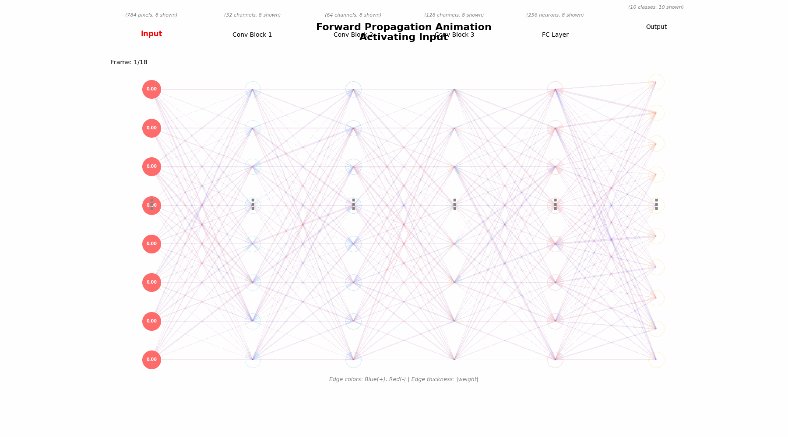
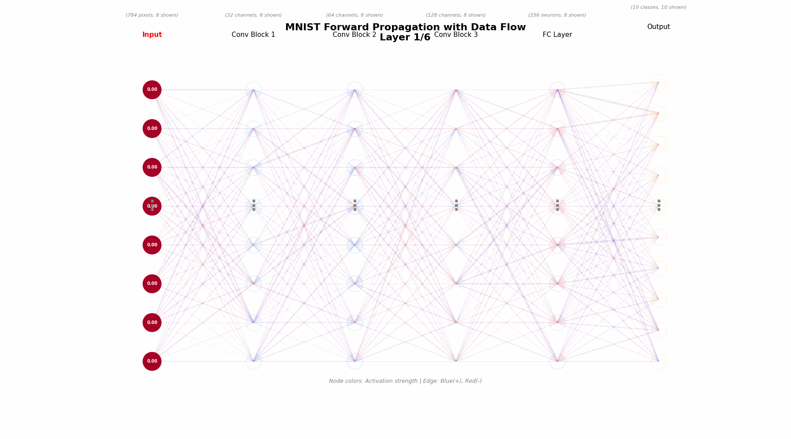
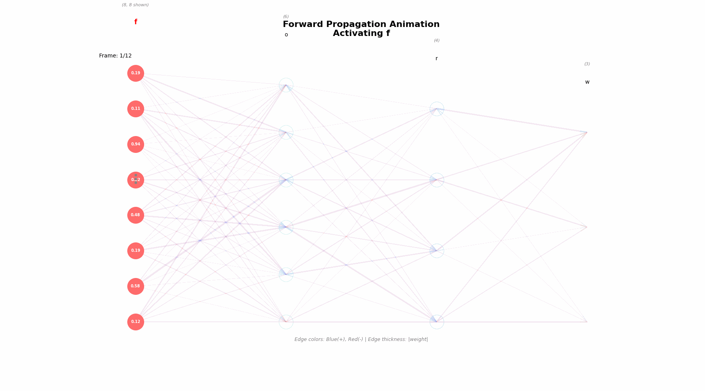
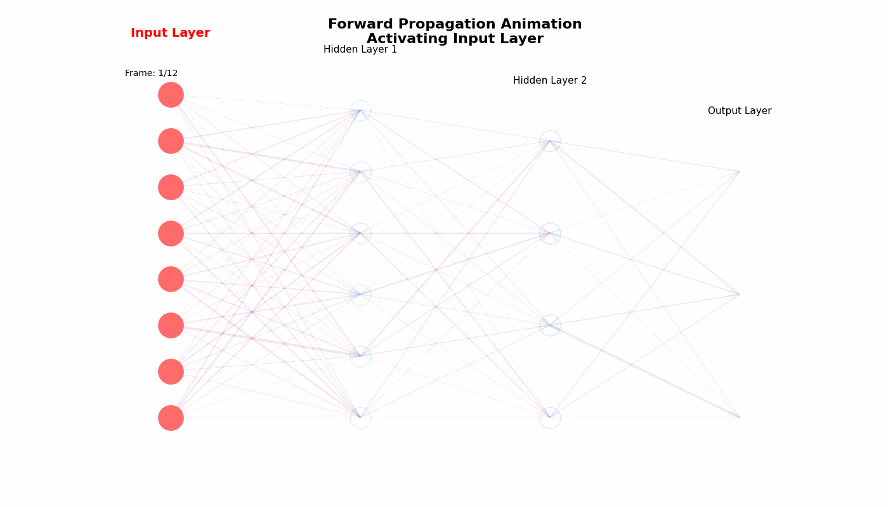

# MNIST Handwritten Digit Classification

A PyTorch implementation of a Convolutional Neural Network (CNN) for classifying handwritten digits from the MNIST dataset, achieving **99.49% validation accuracy**.



## Table of Contents
- [Overview](#overview)
- [Features](#features)
- [Model Architecture](#model-architecture)
- [Results](#results)
- [Project Structure](#project-structure)
- [Installation](#installation)
- [Usage](#usage)
- [Visualization](#visualization)
- [Technical Details](#technical-details)

## Overview

This project implements a deep learning solution for recognizing handwritten digits (0-9) using the MNIST dataset. The implementation includes comprehensive training, evaluation, visualization, and prediction pipelines.



### Key Achievements
- **Validation Accuracy:** 99.49%
- **Training Accuracy:** 99.91%
- **Error Rate:** 0.51% (32 misclassifications out of 6,300 validation samples)
- **Total Parameters:** 437,738

## Features

- Custom CNN architecture with batch normalization and dropout
- Comprehensive training pipeline with learning rate scheduling
- Extensive visualization of model internals:
  - Learned convolutional filters
  - Feature maps at each layer
  - Activation strength analysis
  - Misclassification analysis
- Real-time training progress tracking
- Model checkpointing (best & final models)
- Kaggle submission generation

## Model Architecture

### Network Structure

```
Input (1×28×28)
    ↓
[Conv Block 1: 32 filters]
    Conv2d(1→32) + BatchNorm + ReLU
    Conv2d(32→32) + BatchNorm + ReLU
    MaxPool2d(2×2) + Dropout(0.25)
    ↓ (32×14×14)
[Conv Block 2: 64 filters]
    Conv2d(32→64) + BatchNorm + ReLU
    Conv2d(64→64) + BatchNorm + ReLU
    MaxPool2d(2×2) + Dropout(0.25)
    ↓ (64×7×7)
[Conv Block 3: 128 filters]
    Conv2d(64→128) + BatchNorm + ReLU
    MaxPool2d(2×2) + Dropout(0.25)
    ↓ (128×3×3)
Flatten → 1152 features
    ↓
[Fully Connected Layers]
    Linear(1152→256) + BatchNorm + ReLU + Dropout(0.5)
    Linear(256→10)
    ↓
Output (10 classes)
```



### Architecture Highlights

- **3 Convolutional Blocks** with increasing filter depth (32 → 64 → 128)
- **Batch Normalization** after each convolutional layer for stable training
- **Dropout Regularization** (0.25 for conv layers, 0.5 for FC layers)
- **MaxPooling** for spatial dimension reduction
- **ReLU Activations** for non-linearity

## Results

### Training Performance

| Metric | Value |
|--------|-------|
| Best Validation Accuracy | 99.49% (Epoch 29) |
| Final Training Accuracy | 99.91% |
| Final Validation Accuracy | 99.44% |
| Total Training Epochs | 30 |
| Batch Size | 128 |
| Learning Rate | 0.001 (with ReduceLROnPlateau) |
| Training Samples | 35,700 |
| Validation Samples | 6,300 |
| Test Samples | 28,000 |

### Per-Class Performance

All digits achieved 99% precision, recall, and F1-score on the validation set.

| Digit | Precision | Recall | F1-Score | Support |
|-------|-----------|--------|----------|---------|
| 0 | 1.00 | 1.00 | 1.00 | 620 |
| 1 | 0.99 | 1.00 | 1.00 | 703 |
| 2 | 1.00 | 1.00 | 1.00 | 627 |
| 3 | 1.00 | 0.99 | 0.99 | 653 |
| 4 | 1.00 | 1.00 | 1.00 | 611 |
| 5 | 0.99 | 0.99 | 0.99 | 569 |
| 6 | 1.00 | 1.00 | 1.00 | 620 |
| 7 | 0.99 | 1.00 | 0.99 | 660 |
| 8 | 1.00 | 0.99 | 0.99 | 609 |
| 9 | 0.99 | 1.00 | 0.99 | 628 |

## Project Structure

```
handwriting/
├── animations/                          # Visualization animations
│   ├── forward_propagation.gif
│   ├── forward_propagation_demo.gif
│   ├── mnist_data_flow.gif
│   └── mnist_forward_propagation.gif
├── digit-recognizer/                    # Dataset directory
│   ├── train.csv                        # Training data (42,000 samples)
│   └── test.csv                         # Test data (28,000 samples)
├── models/                              # Saved model checkpoints
│   ├── best_mnist_model.pth            # Best validation accuracy model
│   ├── final_mnist_model.pth           # Final trained model
│   ├── training_history.png
│   ├── confusion_matrix.png
│   ├── sample_predictions.png
│   └── misclassified_examples.png
├── visualizations/                      # Generated visualizations
│   ├── filters_conv1.png
│   ├── complete_prediction_*.png
│   ├── activation_analysis.png
│   └── test_prediction_distribution.png
├── graph_visualizations/                # Additional graphs
├── mnist_training.ipynb                 # Main training notebook
├── mnist_prediction.ipynb               # Prediction & visualization
├── mnist_graph_visualization.ipynb      # Graph analysis
├── mnist_forward_animation.ipynb        # Animation generation
├── digit_recognizer_analysis.ipynb      # Dataset analysis
├── submission.csv                       # Kaggle submission file
└── README.md                            # This file
```

## Installation

### Prerequisites

- Python 3.8+
- CUDA-capable GPU (recommended, but CPU works too)

### Dependencies

```bash
pip install torch torchvision
pip install pandas numpy matplotlib seaborn
pip install scikit-learn tqdm jupyter
```

### Quick Start

1. Clone or download this repository
2. Ensure the dataset is in `digit-recognizer/` directory
3. Run the training notebook: `mnist_training.ipynb`
4. Generate predictions: `mnist_prediction.ipynb`

## Usage

### Training the Model

Open and run `mnist_training.ipynb`:

```python
# Key hyperparameters
CONFIG = {
    'batch_size': 128,
    'epochs': 30,
    'learning_rate': 0.001,
    'val_split': 0.15,
    'num_classes': 10
}
```

The notebook will:
1. Load and preprocess the MNIST dataset
2. Create train/validation split (85%/15%)
3. Train the CNN model with progress tracking
4. Save the best model based on validation accuracy
5. Generate comprehensive visualizations

### Making Predictions

Open and run `mnist_prediction.ipynb`:

```python
# Loads the best trained model
# Generates predictions for test set
# Creates visualization of the prediction process
# Saves submission.csv for Kaggle
```

### Analyzing Results

Each notebook includes detailed analysis:
- **Training metrics:** Loss and accuracy curves
- **Confusion matrix:** Per-class performance
- **Misclassification analysis:** Examples of errors
- **Feature maps:** Internal layer activations
- **Filter visualization:** What the network learned

## Visualization



### Available Visualizations

1. **Learned Filters**: Visualizes the 3×3 convolutional kernels learned by the network
2. **Feature Maps**: Shows activation patterns at each convolutional layer
3. **Complete Prediction Pipeline**: End-to-end visualization from input to output
4. **Activation Strength Analysis**: Statistics of neuron activations per layer
5. **Training History**: Loss and accuracy curves over epochs
6. **Confusion Matrix**: Heatmap of predictions vs. true labels
7. **Misclassified Examples**: Difficult cases where the model failed

### Example Visualizations

The prediction notebook generates detailed visualizations showing:
- Original input image (28×28 grayscale)
- Feature maps after each convolutional layer
- Pooling effects on spatial dimensions
- FC layer neuron activations
- Final softmax probabilities for all 10 digits

## Technical Details

### Data Preprocessing

- **Normalization**: Pixel values scaled to [0, 1] range
- **Reshaping**: Flattened 784-pixel vectors → 28×28 images
- **Channel Addition**: Single-channel (grayscale) format
- **Stratified Split**: Maintains class distribution in train/val split

### Training Strategy

- **Loss Function**: CrossEntropyLoss
- **Optimizer**: Adam with initial LR of 0.001
- **LR Scheduler**: ReduceLROnPlateau (factor=0.5, patience=3)
- **Regularization**: Dropout (0.25-0.5) + Batch Normalization
- **Early Stopping**: Model checkpointing based on validation accuracy

### Hardware & Performance

- **Training Device**: NVIDIA GeForce RTX 3060
- **Training Time**: ~30 epochs
- **Inference Speed**: ~227 samples/second
- **Model Size**: 437,738 parameters (~1.7 MB)

### Reproducibility

```python
SEED = 42
torch.manual_seed(SEED)
np.random.seed(SEED)
```

Random seeds are set for reproducible results.

## Dataset

This project uses the [MNIST Handwritten Digit Database](http://yann.lecun.com/exdb/mnist/):
- **Training Set**: 42,000 labeled images
- **Test Set**: 28,000 unlabeled images
- **Image Size**: 28×28 pixels (grayscale)
- **Classes**: 10 digits (0-9)
- **Format**: CSV files with pixel intensities

## License

This project is for educational purposes. The MNIST dataset is publicly available.

## Acknowledgments

- MNIST dataset by Yann LeCun, Corinna Cortes, and Christopher J.C. Burges
- PyTorch framework
- Kaggle "Digit Recognizer" competition

---

**Author**: TechieQuokka
**Last Updated**: December 2025
**Framework**: PyTorch
**Task**: Multi-class Image Classification
